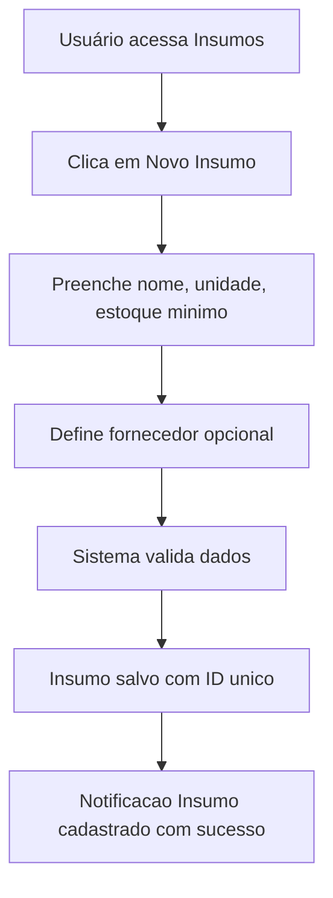
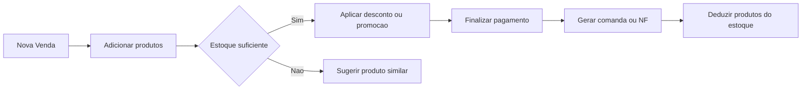

# Fluxos de Trabalho - Fatia Perfeita

## 1. Fluxo de Cadastro de Insumos

## 2. Fluxo de Cadastro de Insumos
1. Usuário acessa Produção → Nova Produção
2. Seleciona produto final (ex: Pizza Margherita)
3. Sistema exibe lista de insumos necessários com quantidades calculadas
4. Usuário confirma disponibilidade no estoque
5. Sistema:
    * Deduz insumos do estoque
    * Registra data/hora da produção
    * Atualiza estoque do produto final
6. Notificação: "Produção registrada. Estoque atualizado."

## 3. Fluxo de Pedido de Venda

## 4. Fluxo de Alertas Automáticos
* **Estoque baixo:** Notificação quando insumo < estoque mínimo
* **Validade próxima:** Alerta 3 dias antes do vencimento
* **Produção sugerida:** Indicação baseada em histórico de vendas
