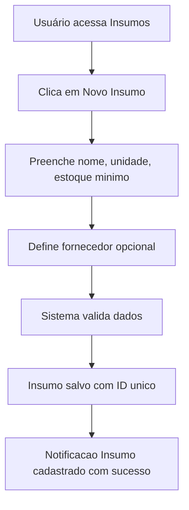

# Fluxos de Trabalho - Fatia Perfeita

## 1. Fluxo de Cadastro de Insumos

```mermaid
graph TD
    A[Usuário acessa Insumos] --> B[Clica em Novo Insumo]
    B --> C[Preenche nome, unidade, estoque minimo]
    C --> D[Define fornecedor opcional]
    D --> E[Sistema valida dados]
    E --> F[Insumo salvo com ID unico]
    F --> G[Notificacao Insumo cadastrado com sucesso]
```
